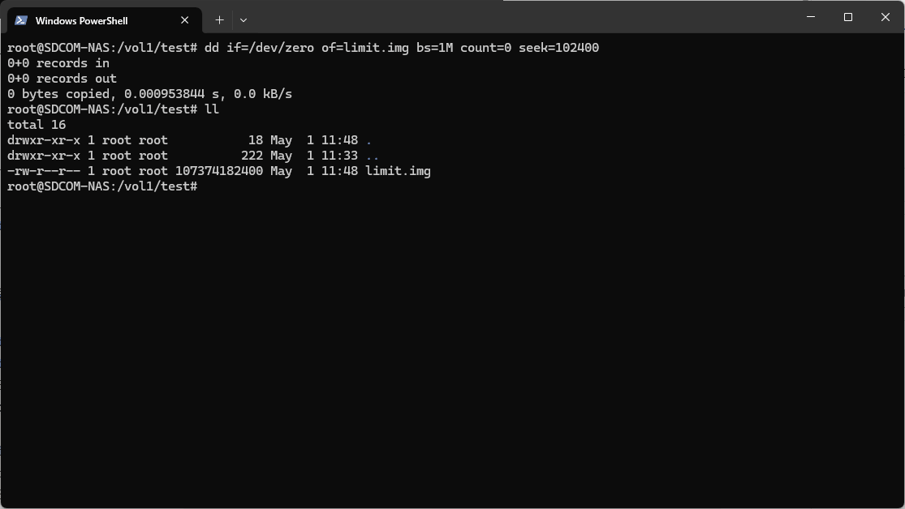
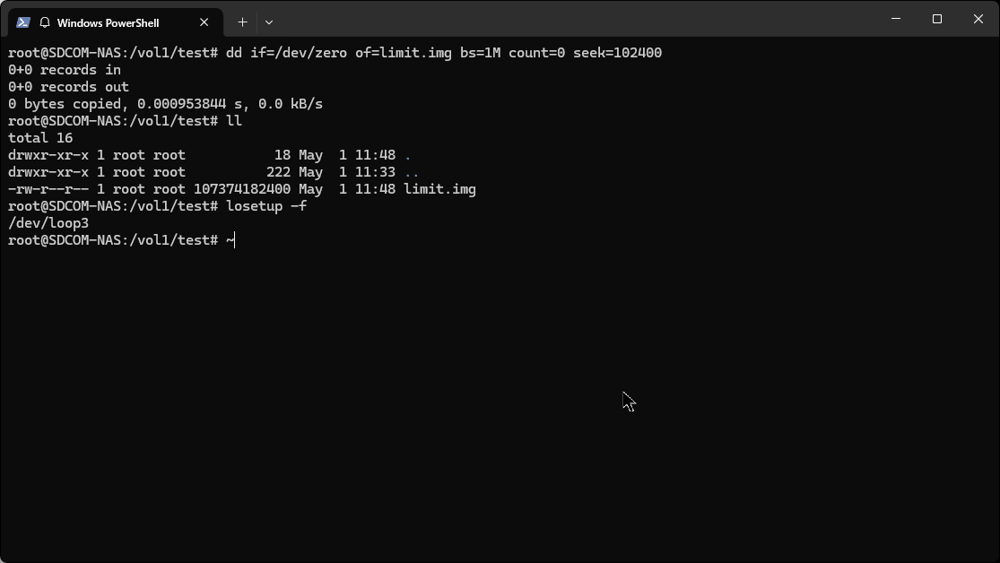
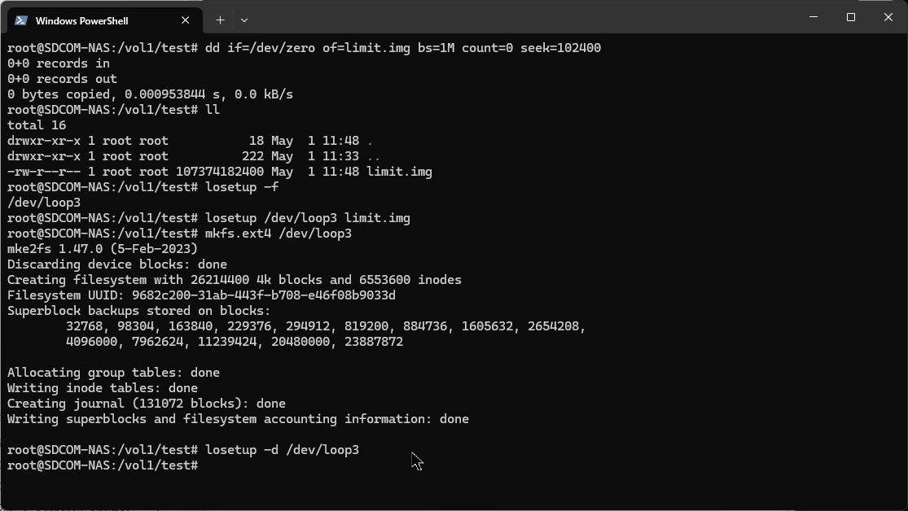
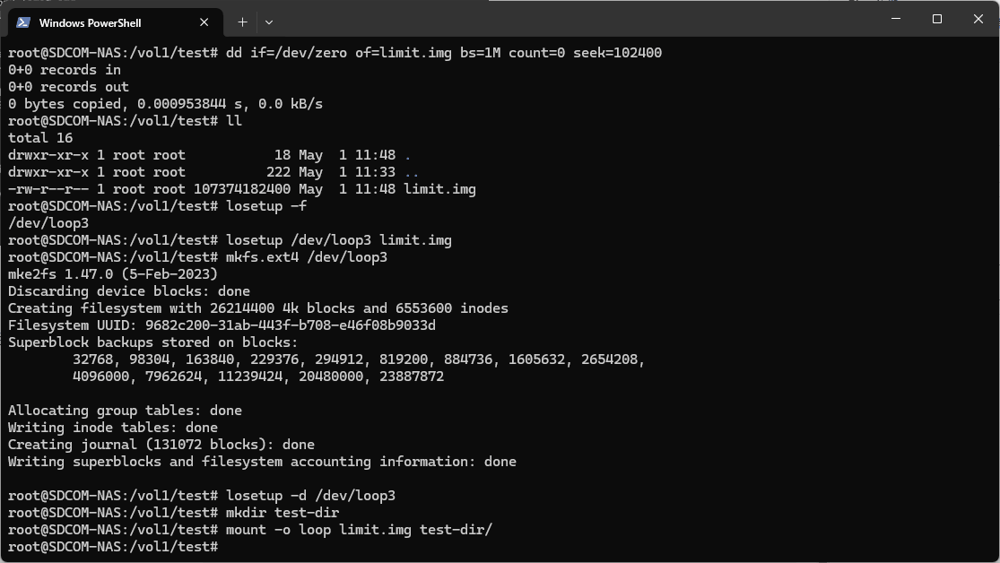
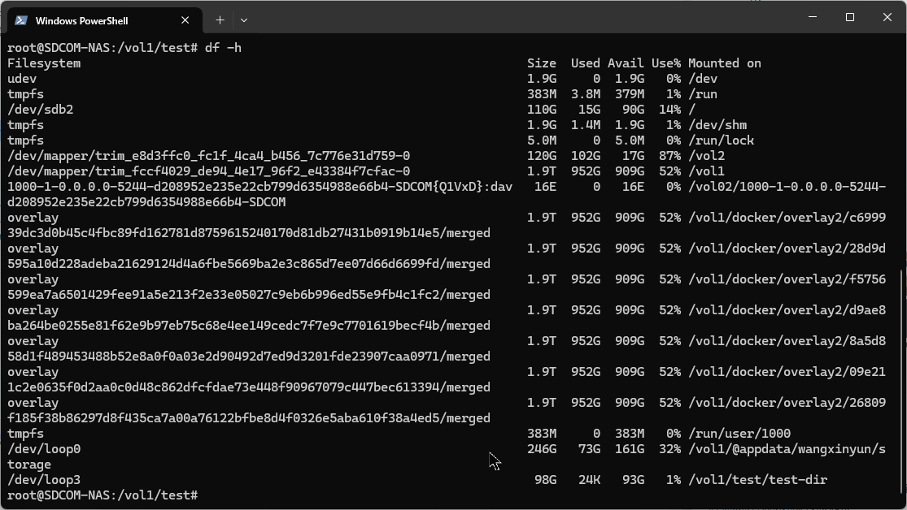
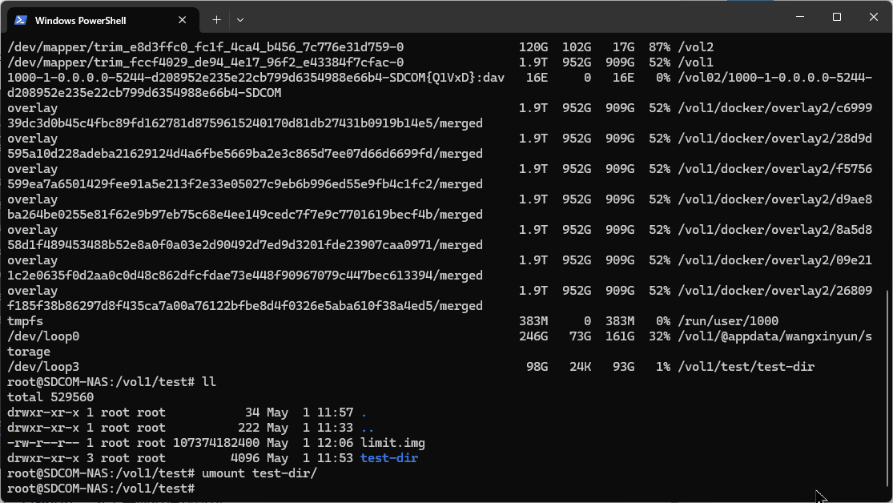
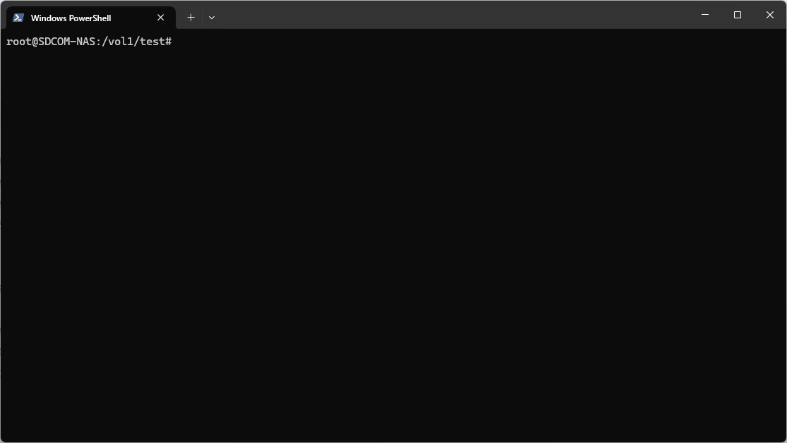
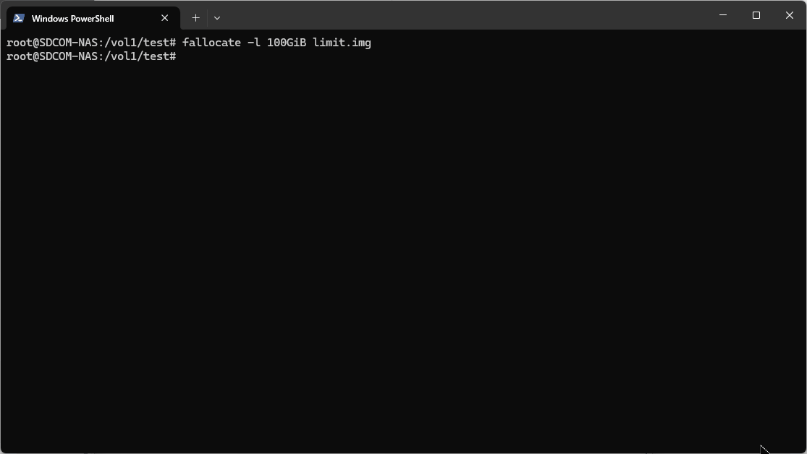
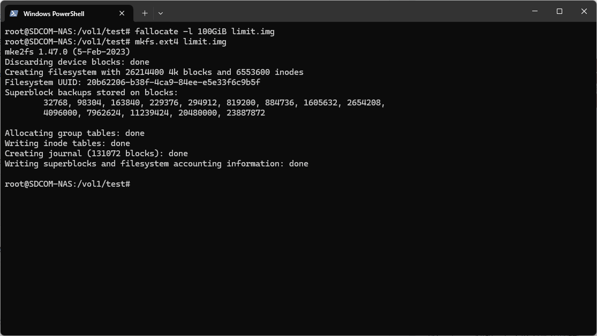
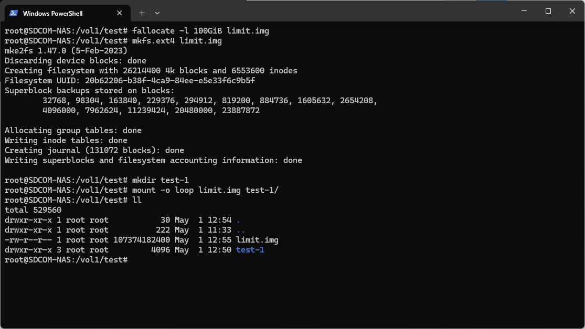

# 前言

我最近正在用我的NAS上的docker测试一个项目，但是那很占用的我的NAS空间

但是，docker也没有限制某个目录占用空间的方法，所以我就想到可以通过限制那个挂载目录来限制那个项目的占用空间

# 实现

这里我准备了两种方法，均成功限制了目录空间

## 方法一

### 分配空置的img镜像

通过`dd`指令可以分配一个全为`0`的`100GiB`大小的img镜像：

```
root@SDCOM-NAS:/vol1/test# dd if=/dev/zero of=limit.img bs=1M count=0 seek=102400
0+0 records in
0+0 records out
0 bytes copied, 0.000953844 s, 0.0 kB/s
root@SDCOM-NAS:/vol1/test# ll
total 16
drwxr-xr-x 1 root root           18 May  1 11:48 .
drwxr-xr-x 1 root root          222 May  1 11:33 ..
-rw-r--r-- 1 root root 107374182400 May  1 11:48 limit.img
```


注：如果这里使用`/dev/urandom`的话产生的img镜像则是一个随机的块，可用于模拟一个存储满各种数据资源的磁盘

### 绑定一个循环分区

首先查看可用的循环分区：

```
root@SDCOM-NAS:/vol1/test# losetup -f
/dev/loop3
```



我们发现可用的是`/dev/loop3`（根据实际情况修改）这个分区，然后用该分区来初始化img镜像，然后卸载镜像：

```
root@SDCOM-NAS:/vol1/test# losetup /dev/loop3 limit.img
root@SDCOM-NAS:/vol1/test# mkfs.ext4 /dev/loop3
mke2fs 1.47.0 (5-Feb-2023)
Discarding device blocks: done
Creating filesystem with 26214400 4k blocks and 6553600 inodes
Filesystem UUID: 7908d52f-3832-4766-8fb6-6122c778d453
Superblock backups stored on blocks:
        32768, 98304, 163840, 229376, 294912, 819200, 884736, 1605632, 2654208,
        4096000, 7962624, 11239424, 20480000, 23887872

Allocating group tables: done
Writing inode tables: done
Creating journal (131072 blocks): done
Writing superblocks and filesystem accounting information: done
root@SDCOM-NAS:/vol1/test# losetup -d /dev/loop3
```



### 创建一个目录并绑定已创建镜像

```
root@SDCOM-NAS:/vol1/test# mkdir test-dir
root@SDCOM-NAS:/vol1/test# mount -o loop limit.img test-dir/
```



### 查看与测试配置生效情况

执行`df -h`命令以查看该绑定目录的挂载情况，可发现该目录已挂载在`/dev/loop3`下：

```
root@SDCOM-NAS:/vol1/test# df -h
Filesystem                                                             Size  Used Avail Use% Mounted on
udev                                                                   1.9G     0  1.9G   0% /dev
tmpfs                                                                  383M  3.8M  379M   1% /run
/dev/sdb2                                                              110G   15G   90G  14% /
tmpfs                                                                  1.9G  1.4M  1.9G   1% /dev/shm
tmpfs                                                                  5.0M     0  5.0M   0% /run/lock
/dev/mapper/trim_e8d3ffc0_fc1f_4ca4_b456_7c776e31d759-0                120G  102G   17G  87% /vol2
/dev/mapper/trim_fccf4029_de94_4e17_96f2_e43384f7cfac-0                1.9T  952G  909G  52% /vol1
1000-1-0.0.0.0-5244-d208952e235e22cb799d6354988e66b4-SDCOM{Q1VxD}:dav   16E     0   16E   0% /vol02/1000-1-0.0.0.0-5244-d208952e235e22cb799d6354988e66b4-SDCOM
overlay                                                                1.9T  952G  909G  52% /vol1/docker/overlay2/c699939dc3d0b45c4fbc89fd162781d8759615240170d81db27431b0919b14e5/merged
overlay                                                                1.9T  952G  909G  52% /vol1/docker/overlay2/28d9d595a10d228adeba21629124d4a6fbe5669ba2e3c865d7ee07d66d6699fd/merged
overlay                                                                1.9T  952G  909G  52% /vol1/docker/overlay2/f5756599ea7a6501429fee91a5e213f2e33e05027c9eb6b996ed55e9fb4c1fc2/merged
overlay                                                                1.9T  952G  909G  52% /vol1/docker/overlay2/d9ae8ba264be0255e81f62e9b97eb75c68e4ee149cedc7f7e9c7701619becf4b/merged
overlay                                                                1.9T  952G  909G  52% /vol1/docker/overlay2/8a5d858d1f489453488b52e8a0f0a03e2d90492d7ed9d3201fde23907caa0971/merged
overlay                                                                1.9T  952G  909G  52% /vol1/docker/overlay2/09e211c2e0635f0d2aa0c0d48c862dfcfdae73e448f90967079c447bec613394/merged
overlay                                                                1.9T  952G  909G  52% /vol1/docker/overlay2/26809f185f38b86297d8f435ca7a00a76122bfbe8d4f0326e5aba610f38a4ed5/merged
tmpfs                                                                  383M     0  383M   0% /run/user/1000
/dev/loop0                                                             246G   73G  161G  32% /vol1/@appdata/wangxinyun/storage
/dev/loop3                                                              98G   24K   93G   1% /vol1/test/test-dir
```



### 取消该文件的挂载

首先返回到绑定文件夹所在的目录层，然后执行`umount`指令：

```
root@SDCOM-NAS:/vol1/test# ll
total 529560
drwxr-xr-x 1 root root           34 May  1 11:57 .
drwxr-xr-x 1 root root          222 May  1 11:33 ..
-rw-r--r-- 1 root root 107374182400 May  1 12:06 limit.img
drwxr-xr-x 3 root root         4096 May  1 11:53 test-dir
root@SDCOM-NAS:/vol1/test# umount test-dir/
```



在`umount`之后，我们发现在挂载目录中的`test-dir`已经消失，这表示取消挂载成功。

```
root@SDCOM-NAS:/vol1/test# df -h
Filesystem                                                             Size  Used Avail Use% Mounted on
udev                                                                   1.9G     0  1.9G   0% /dev
tmpfs                                                                  383M  3.8M  379M   1% /run
/dev/sdb2                                                              110G   15G   90G  14% /
tmpfs                                                                  1.9G  1.4M  1.9G   1% /dev/shm
tmpfs                                                                  5.0M     0  5.0M   0% /run/lock
/dev/mapper/trim_e8d3ffc0_fc1f_4ca4_b456_7c776e31d759-0                120G  102G   17G  87% /vol2
/dev/mapper/trim_fccf4029_de94_4e17_96f2_e43384f7cfac-0                1.9T  957G  905G  52% /vol1
1000-1-0.0.0.0-5244-d208952e235e22cb799d6354988e66b4-SDCOM{Q1VxD}:dav   16E     0   16E   0% /vol02/1000-1-0.0.0.0-5244-d208952e235e22cb799d6354988e66b4-SDCOM
overlay                                                                1.9T  957G  905G  52% /vol1/docker/overlay2/c699939dc3d0b45c4fbc89fd162781d8759615240170d81db27431b0919b14e5/merged
overlay                                                                1.9T  957G  905G  52% /vol1/docker/overlay2/28d9d595a10d228adeba21629124d4a6fbe5669ba2e3c865d7ee07d66d6699fd/merged
overlay                                                                1.9T  957G  905G  52% /vol1/docker/overlay2/f5756599ea7a6501429fee91a5e213f2e33e05027c9eb6b996ed55e9fb4c1fc2/merged
overlay                                                                1.9T  957G  905G  52% /vol1/docker/overlay2/d9ae8ba264be0255e81f62e9b97eb75c68e4ee149cedc7f7e9c7701619becf4b/merged
overlay                                                                1.9T  957G  905G  52% /vol1/docker/overlay2/8a5d858d1f489453488b52e8a0f0a03e2d90492d7ed9d3201fde23907caa0971/merged
overlay                                                                1.9T  957G  905G  52% /vol1/docker/overlay2/09e211c2e0635f0d2aa0c0d48c862dfcfdae73e448f90967079c447bec613394/merged
overlay                                                                1.9T  957G  905G  52% /vol1/docker/overlay2/26809f185f38b86297d8f435ca7a00a76122bfbe8d4f0326e5aba610f38a4ed5/merged
tmpfs                                                                  383M     0  383M   0% /run/user/1000
/dev/loop0                                                             246G   77G  156G  34% /vol1/@appdata/wangxinyun/storage
```



## 方法二

### 分配空img镜像

使用`fallocate`分配一个镜像：

```
root@SDCOM-NAS:/vol1/test# fallocate -l 100GiB limit.img
```



### 初始化img镜像

使用`mkfs.ext4`命令初始化镜像

```
root@SDCOM-NAS:/vol1/test# mkfs.ext4 limit.img
mke2fs 1.47.0 (5-Feb-2023)
Discarding device blocks: done
Creating filesystem with 26214400 4k blocks and 6553600 inodes
Filesystem UUID: 20b62206-b38f-4ca9-84ee-e5e33f6c9b5f
Superblock backups stored on blocks:
        32768, 98304, 163840, 229376, 294912, 819200, 884736, 1605632, 2654208,
        4096000, 7962624, 11239424, 20480000, 23887872

Allocating group tables: done
Writing inode tables: done
Creating journal (131072 blocks): done
Writing superblocks and filesystem accounting information: done
```



### 创建一个目录并绑定已创建镜像

```
root@SDCOM-NAS:/vol1/test# mkdir test-1
root@SDCOM-NAS:/vol1/test# mount -o loop limit.img test-1/
root@SDCOM-NAS:/vol1/test# ll
total 529560
drwxr-xr-x 1 root root           30 May  1 12:54 .
drwxr-xr-x 1 root root          222 May  1 11:33 ..
-rw-r--r-- 1 root root 107374182400 May  1 12:55 limit.img
drwxr-xr-x 3 root root         4096 May  1 12:50 test-1
```



### 查看与测试配置生效情况

使用df -h测试挂载情况，可以发现已经挂载：

```
root@SDCOM-NAS:/vol1/test# df -h
Filesystem                                                             Size  Used Avail Use% Mounted on
udev                                                                   1.9G     0  1.9G   0% /dev
tmpfs                                                                  383M  3.8M  379M   1% /run
/dev/sdb2                                                              110G   15G   90G  14% /
tmpfs                                                                  1.9G  1.4M  1.9G   1% /dev/shm
tmpfs                                                                  5.0M     0  5.0M   0% /run/lock
/dev/mapper/trim_e8d3ffc0_fc1f_4ca4_b456_7c776e31d759-0                120G  102G   17G  87% /vol2
/dev/mapper/trim_fccf4029_de94_4e17_96f2_e43384f7cfac-0                1.9T  959G  903G  52% /vol1
1000-1-0.0.0.0-5244-d208952e235e22cb799d6354988e66b4-SDCOM{Q1VxD}:dav   16E     0   16E   0% /vol02/1000-1-0.0.0.0-5244-d208952e235e22cb799d6354988e66b4-SDCOM
overlay                                                                1.9T  959G  903G  52% /vol1/docker/overlay2/c699939dc3d0b45c4fbc89fd162781d8759615240170d81db27431b0919b14e5/merged
overlay                                                                1.9T  959G  903G  52% /vol1/docker/overlay2/28d9d595a10d228adeba21629124d4a6fbe5669ba2e3c865d7ee07d66d6699fd/merged
overlay                                                                1.9T  959G  903G  52% /vol1/docker/overlay2/f5756599ea7a6501429fee91a5e213f2e33e05027c9eb6b996ed55e9fb4c1fc2/merged
overlay                                                                1.9T  959G  903G  52% /vol1/docker/overlay2/d9ae8ba264be0255e81f62e9b97eb75c68e4ee149cedc7f7e9c7701619becf4b/merged
overlay                                                                1.9T  959G  903G  52% /vol1/docker/overlay2/8a5d858d1f489453488b52e8a0f0a03e2d90492d7ed9d3201fde23907caa0971/merged
overlay                                                                1.9T  959G  903G  52% /vol1/docker/overlay2/09e211c2e0635f0d2aa0c0d48c862dfcfdae73e448f90967079c447bec613394/merged
overlay                                                                1.9T  959G  903G  52% /vol1/docker/overlay2/26809f185f38b86297d8f435ca7a00a76122bfbe8d4f0326e5aba610f38a4ed5/merged
tmpfs                                                                  383M     0  383M   0% /run/user/1000
/dev/loop0                                                             246G   79G  154G  34% /vol1/@appdata/wangxinyun/storage
/dev/loop3                                                              98G   24K   93G   1% /vol1/test/test-1
```



### 取消该文件的挂载

依旧使用`umount`取消挂载：

```
root@SDCOM-NAS:/vol1/test# umount test-1
root@SDCOM-NAS:/vol1/test# df -h
Filesystem                                                             Size  Used Avail Use% Mounted on
udev                                                                   1.9G     0  1.9G   0% /dev
tmpfs                                                                  383M  3.8M  379M   1% /run
/dev/sdb2                                                              110G   15G   90G  14% /
tmpfs                                                                  1.9G  1.4M  1.9G   1% /dev/shm
tmpfs                                                                  5.0M     0  5.0M   0% /run/lock
/dev/mapper/trim_e8d3ffc0_fc1f_4ca4_b456_7c776e31d759-0                120G  102G   17G  87% /vol2
/dev/mapper/trim_fccf4029_de94_4e17_96f2_e43384f7cfac-0                1.9T  959G  903G  52% /vol1
1000-1-0.0.0.0-5244-d208952e235e22cb799d6354988e66b4-SDCOM{Q1VxD}:dav   16E     0   16E   0% /vol02/1000-1-0.0.0.0-5244-d208952e235e22cb799d6354988e66b4-SDCOM
overlay                                                                1.9T  959G  903G  52% /vol1/docker/overlay2/c699939dc3d0b45c4fbc89fd162781d8759615240170d81db27431b0919b14e5/merged
overlay                                                                1.9T  959G  903G  52% /vol1/docker/overlay2/28d9d595a10d228adeba21629124d4a6fbe5669ba2e3c865d7ee07d66d6699fd/merged
overlay                                                                1.9T  959G  903G  52% /vol1/docker/overlay2/f5756599ea7a6501429fee91a5e213f2e33e05027c9eb6b996ed55e9fb4c1fc2/merged
overlay                                                                1.9T  959G  903G  52% /vol1/docker/overlay2/d9ae8ba264be0255e81f62e9b97eb75c68e4ee149cedc7f7e9c7701619becf4b/merged
overlay                                                                1.9T  959G  903G  52% /vol1/docker/overlay2/8a5d858d1f489453488b52e8a0f0a03e2d90492d7ed9d3201fde23907caa0971/merged
overlay                                                                1.9T  959G  903G  52% /vol1/docker/overlay2/09e211c2e0635f0d2aa0c0d48c862dfcfdae73e448f90967079c447bec613394/merged
overlay                                                                1.9T  959G  903G  52% /vol1/docker/overlay2/26809f185f38b86297d8f435ca7a00a76122bfbe8d4f0326e5aba610f38a4ed5/merged
tmpfs                                                                  383M     0  383M   0% /run/user/1000
/dev/loop0                                                             246G   79G  154G  34% /vol1/@appdata/wangxinyun/storage
```

在`umount`之后，我们发现在挂载目录中的`test-1`已经消失，这表示取消挂载成功。

# 尾声

通过以上的方案可以很好的定制化一个特殊的目录，更好的用于管理和规范一个用于执行任务的文件系统，避免资源的恶意占用等问题。

_妈妈再也不用担心我跑项目的时候把我的空间跑的一点不剩了_~

**最后温馨提示：操作有风险，玩机需谨慎，教程仅供参考，操作具体情况请以个人设备为准！**
